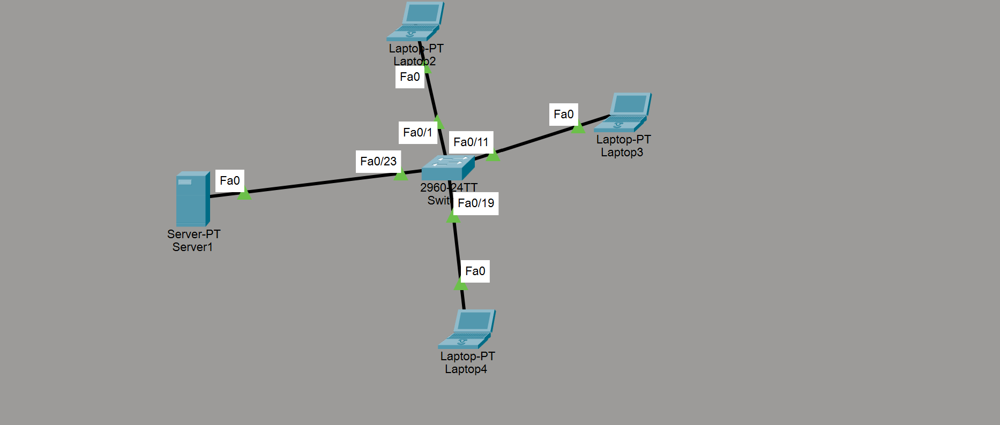
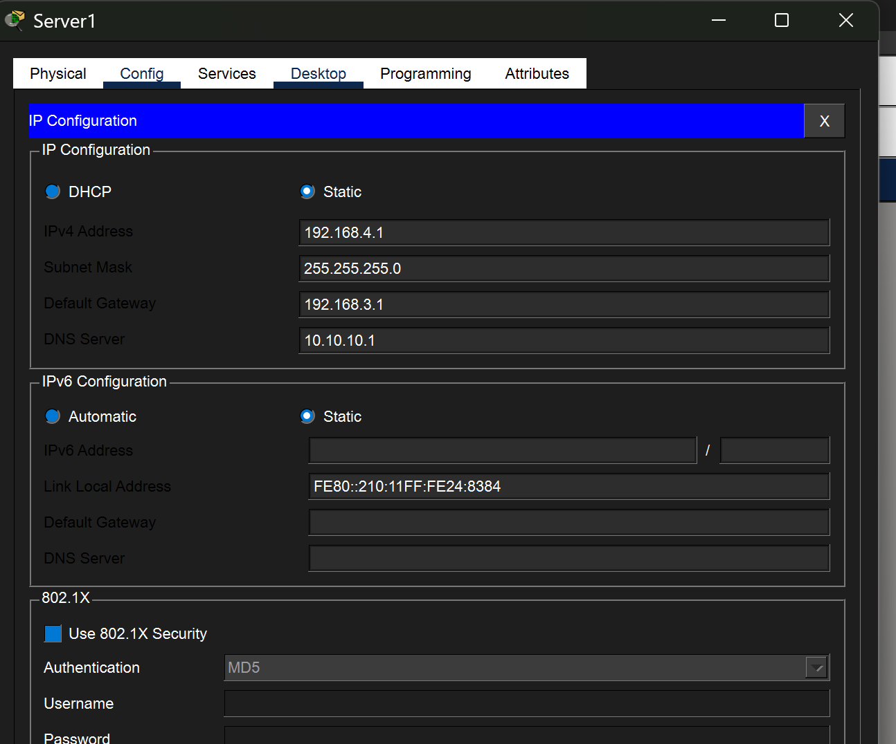
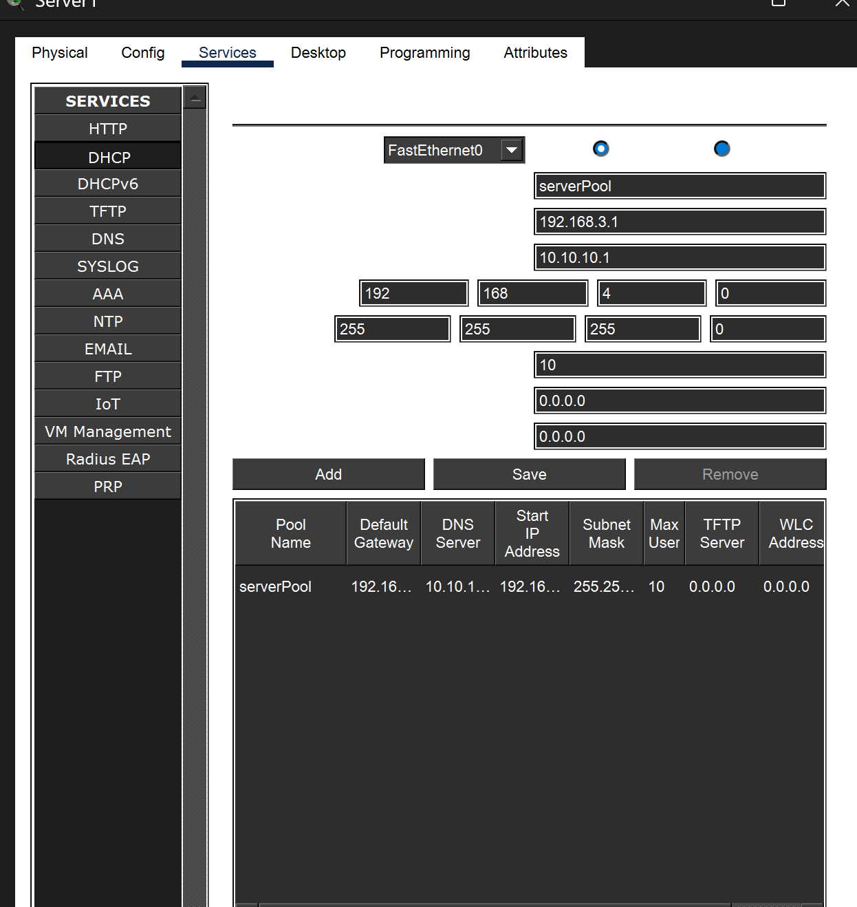
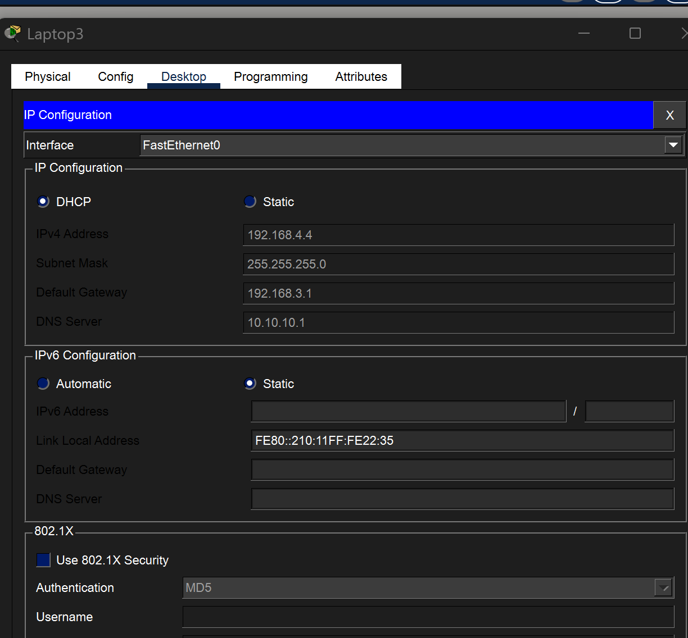
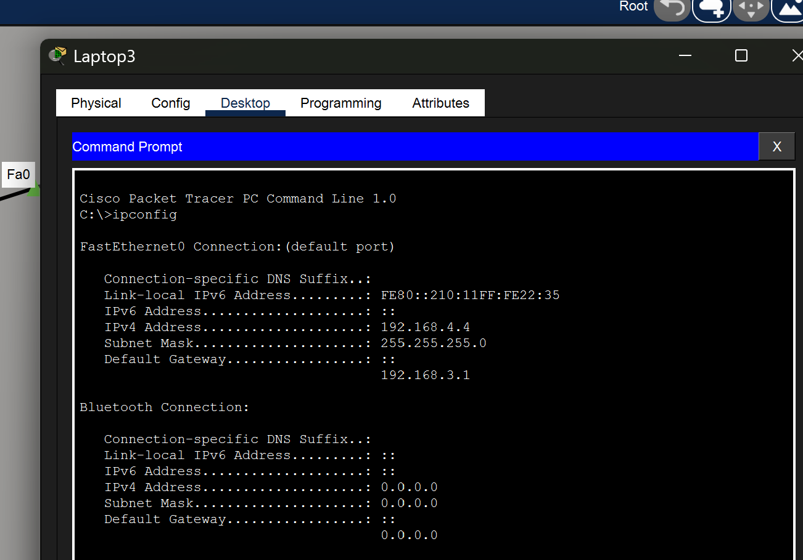

# Cisco---DHCP-Configuration-Server-Based-

# Cisco Packet Tracer – DHCP Configuration (Server-Based)

This repository demonstrates **DHCP configuration using a Server-PT** in **Cisco Packet Tracer**. The setup shows how end devices (laptops) automatically obtain IPv4 addresses from a DHCP server connected through a switch.

---

## 📌 Network Topology Overview

This project uses a simple **star topology** where all end devices connect to a central switch.

**Devices used:**

* **Server-PT** → Acts as the DHCP server
* **Cisco 2960-24TT Switch** → Central switching device
* **Laptop-PT (Clients)** → Receive IPs dynamically via DHCP

### 🔹 Topology Diagram



---

## 🖧 IP Addressing Scheme

| Device          | IP Address      | Method           |
| --------------- | --------------- | ---------------- |
| Server1         | 192.168.4.1 /24 | Static           |
| Laptop2         | DHCP            | Dynamic          |
| Laptop3         | DHCP            | Dynamic          |
| Laptop4         | DHCP            | Dynamic          |
| Default Gateway | 192.168.3.1     | Provided by DHCP |
| DNS Server      | 10.10.10.1      | Provided by DHCP |

---

## ⚙️ Step-by-Step Configuration

### 1️⃣ Server Static IP Configuration

The DHCP server must use a **static IP address** so clients can reliably contact it.

**Configuration location:**
`Server → Desktop → IP Configuration → Static`

**Settings used:**

* IPv4 Address: `192.168.4.1`
* Subnet Mask: `255.255.255.0`
* Default Gateway: `192.168.3.1`
* DNS Server: `10.10.10.1`

### 🔹 Server Static IP Screenshot



---

### 2️⃣ Enabling DHCP Service on Server

The DHCP service is enabled and configured on the server.

**Configuration location:**
`Server → Services → DHCP`

**DHCP Pool Details:**

* Pool Name: `serverPool`
* Default Gateway: `192.168.3.1`
* DNS Server: `10.10.10.1`
* Start IP Address: `192.168.4.2`
* Subnet Mask: `255.255.255.0`
* Maximum Users: `10`

### 🔹 DHCP Pool Configuration Screenshot



---

### 3️⃣ Network Topology in Packet Tracer

All devices are connected to a **Cisco 2960-24TT switch** using FastEthernet ports.

---

### 4️⃣ Client Configuration (Laptops)

Each laptop is configured to **obtain an IP address automatically**.

**Configuration location:**
`Laptop → Desktop → IP Configuration → DHCP`

This allows the client to send a DHCP Discover message to the server.

### 🔹 Laptop DHCP Mode Screenshot



---

### 5️⃣ IP Address Verification

To confirm DHCP is working, the assigned IP address is checked from the laptop.

**Command used:**

```
ipconfig
```

**Observed results:**

* IPv4 Address: `192.168.4.x`
* Subnet Mask: `255.255.255.0`
* Default Gateway: `192.168.3.1`

### 🔹 IP Assigned Automatically Screenshot



---

## ✅ Result

* DHCP server successfully assigns IP addresses
* Clients automatically configure network settings
* Centralized and scalable IP management achieved


## 🧠 Key Concepts Demonstrated

* DHCP server configuration
* Static vs dynamic IP addressing
* Client-server networking model
* Basic LAN setup using a switch

---


